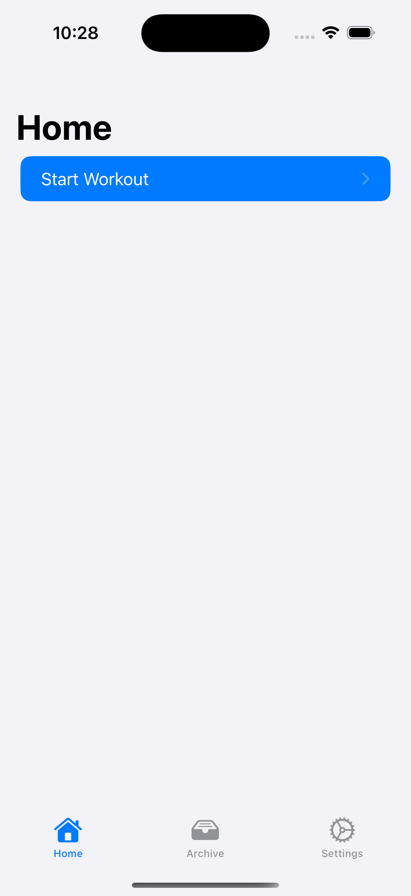
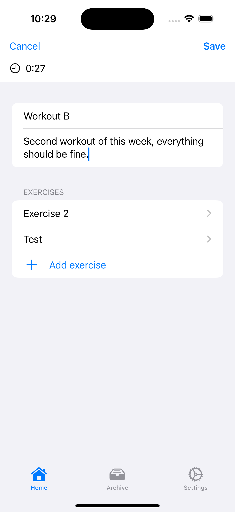
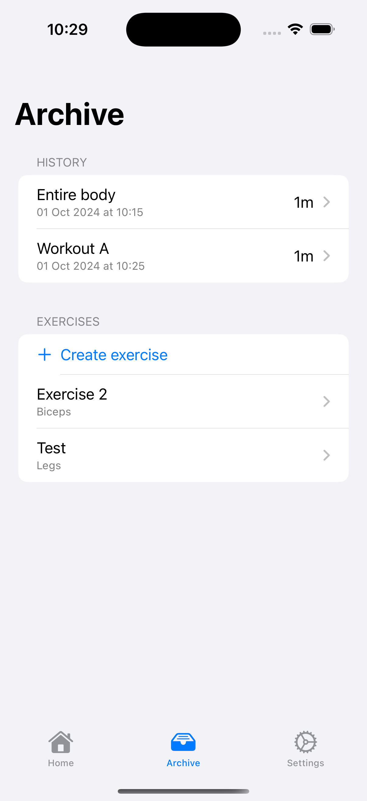

# Stronix

A weightlifting workout tracker for iOS written with SwiftUI and SwiftData, heavily inspired by [Iron](https://github.com/kabouzeid/Iron?tab=readme-ov-file).

|  |  |  |
| -------------------------------- | ------------------------------------------- | ----------------------------------- |
