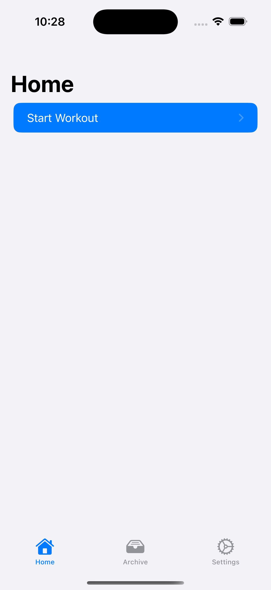
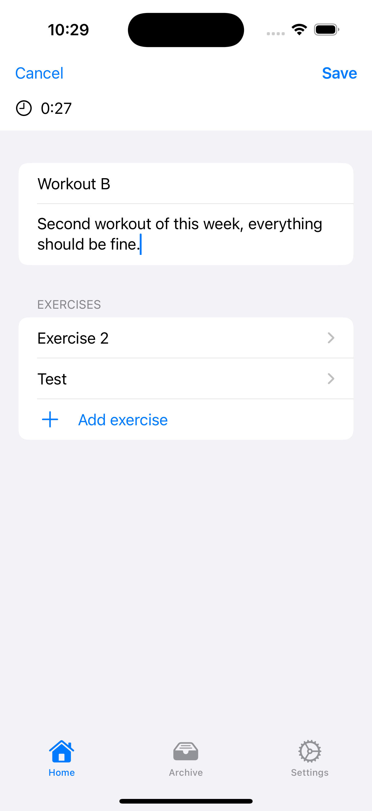
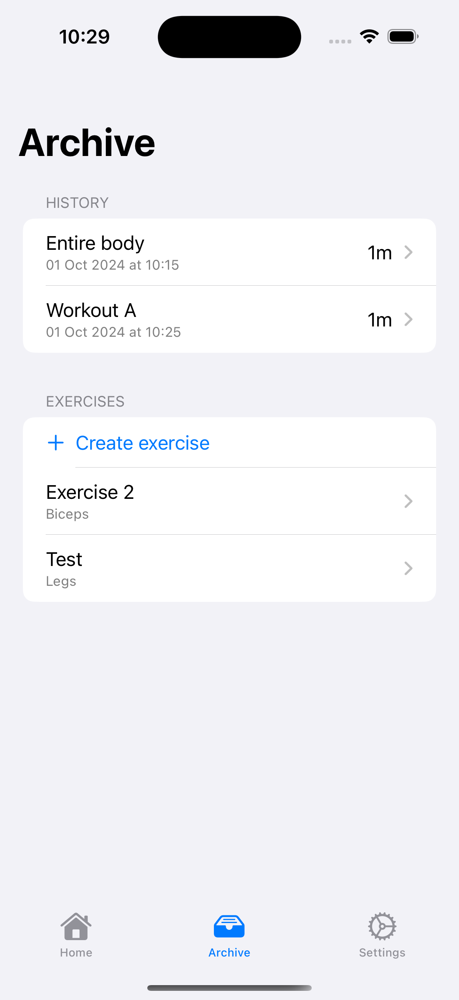

# Stronix

A weightlifting workout tracker for iOS built with SwiftUI and SwiftData, inspired by [Iron](https://github.com/kabouzeid/Iron).

|  |  |  |
| --- | --- | --- |

## Features

- Create and track workouts with exercises, sets, weight, and reps
- Rest timer with haptic feedback, local notifications, and configurable defaults
- Auto-fill weight/reps from previous sets or workout history
- Exercise history shown inline during workouts
- Workout finish summary with share-as-text
- Exercise and workout archive with soft delete
- Drag-to-reorder exercises and sets

## Getting Started

### Prerequisites

- Xcode 15.4+
- iOS 17.5+

### Setup

1. Clone the repo
2. Copy the signing config template:
   ```
   cp Local.xcconfig.template Local.xcconfig
   ```
3. Edit `Local.xcconfig` with your values:
   ```
   STRONIX_TEAM_ID = YOUR_TEAM_ID_HERE
   STRONIX_BUNDLE_PREFIX = com.yourname
   ```
   Find your Team ID at [developer.apple.com/account](https://developer.apple.com/account) → Membership Details.
4. Open `Stronix.xcodeproj` and build (⌘B)

> `Local.xcconfig` is gitignored — each contributor maintains their own. If you change `Local.xcconfig` while Xcode is open, close and reopen the project for the new values to take effect.

## Architecture

- **SwiftUI** views with **SwiftData** `@Model` persistence
- `@Observable` for shared state (e.g., `RestTimer`)
- No singletons — dependencies injected via SwiftUI environment
- Models: `Workout` → `WorkoutExercise` → `WorkoutSet`, plus `Exercise` and `Tag`
